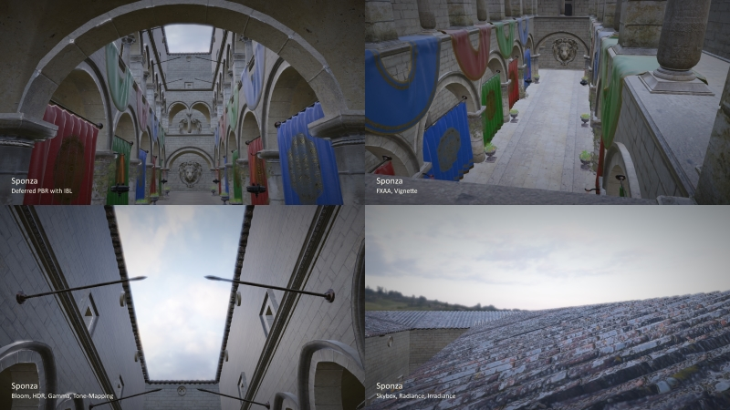

# Hawk

Hawk is a humble attempt to provide a general purpose game engine. 

Brief features are, component based hierarchal entity system, physically based rendering, deferred shading, FMOD implementation, asset manager, frame/time manager, debug context, logging ...

You can watch a video demonstration of rendering Sponza here https://youtu.be/zJNhhMViDrg

Please do note that this is a work in progress.

For a full list of features and properties please read below.

## Build

Build files are provided for Visual Studio 2017. 

Project is built as a static library so developers can have as many projects as they want just so by linking to this library. Demo project is a good example of how you can setup a project properly.

To build, you need the following libraries in <u>libs/</u> folder after extracting project files. All libraries must be their x64 kind with debug and release files. Also library versions which this project was built against are mentioned here as well.

- GLFW 3.2.1
- GLM 0.9.9.3
- GLI 0.8.3.0
- STB (mainly for stb_image)
- Assimp 4.1.0 (Static library compiled with usual importers and no exporter)
  - Don't forget to copy <u>config.h</u> file from <u>assimp/build/</u> directory to <u>assimp/include/</u> directory after building Assimp.
- FMOD 1.10.11
  - Don't forget to copy FMOD runtime dlls to <u>bin/</u> directory.

To place library files please refer to project configuration to see the folder structure.

There are three build configurations:

- Debug: Usual debug config with few tweaks. Also activates OpenGL debug context.
- Development: Usual debug config with few tweaks.
- Release: Usual release config with few performance tweaks.

Don't forget to set Demo project as the start up project!

## Features

### General

- Modern C++ (C++17 compliant).
- Modern OpenGL (4.6).
- Callbacks for scripting events in C++.
- Asset hot loading.

### Managers

- Time
  - Fixed frame and render frame handler.
  - Frame time management (real time, delta time, time scale, fps ...).
- Audio
  - FMOD Studio handler.
- Video
  - Forward/Deferred render.
  - Blinn-Phong lighting model.
  - Microfacet lighting model (Epic Games' PBR Approach Metallic/Roughness Workflow).
  - High Dynamic Range lighting.
  - Environment lighting with reflections support.
  - Soft directional and point shadows.
  - Normal mapping.
  - Parallax occlusion mapping.
  - Multiple cameras.
  - Skybox.
  - Configurable forward light and shadow count.
  - Configurable ambient lighting.
  - Cached GL states.
  - Built-in post-process effects
    - Gamma/Tone-mapping.
    - Bloom.
    - SSAO (Only in deferred).
    - FXAA.
  - Custom post-process effects
    - Invert.
    - Greyscale.
    - Edge detection.
    - Image Sharpening.
    - Blur.
    - Vignette.
- Input
  - Keyboard and mouse buttons tracker.
  - Mouse movement and mouse wheel.
- Assets
  - Importing, sharing and releasing of assets.
  - Easily accessed through named lists.
- Scene
  - Basic world management.
- Logger
  - Logging system with file and console output.

### Assets

- Mesh
  - Mesh encapsulation.
  - Built-in primitive shape generation (quad, cube, sphere) with calculated tangents and bitangents.
- Texture
  - Importing common textures (png, jpg, bmp, tga ...) using stb_image.
  - Importing hdr/mipped textures (hdr, dds, ktx) using stb_image and gli.
  - Flip image y axis, import into sRGB color space, filtering ...
- Shader
  - Shader encapsulation.
  - Store active uniforms locations.
  - Custom #include pre-processor.
  - Built-in shaders
    - Lit (Imported based on render path and lighting method)
    - Unlit
    - Reflective/Refractive
    - Skybox
- Material
  - Managing uniforms and texture samplers using stored locations.
  - Configurable color write, depth, stencil, blending, face cull states.
- Model
  - Importing model files with the same exact hierarchy in entity system using Assimp.
    - Note: Animations are not supported yet.
    - Note: Assimp is not suited for models with PBR textures.
- Sound
  - Importing common audio file formats in 2D or 3D using FMOD.
  - Support for streamed, in-memory or uncompressed methods.

### Components

- Transform
  - Position, rotation and scale encapsulation.
  - Local and world calculation.
  - Optimized for static objects.
- Renderer
  - Mesh Renderer
    - Instancing.
    - Configurable shadow cast and shadow receive.
- Light
  - Directional, point and spot lights.
  - Intensity and Range (Based on UE4 light fall off formula) configuration.
  - Configurable shadow cast.
- Camera
  - Separate render buffers for forward, deferred and final render stages.
  - Custom materials list to apply post-process effects.
  - Configurable background color or skybox.
  - Configurable radiance and irradiance maps.
- Audio Listener
  - Audio listener with velocity changes.
- Audio Player
  - Sound player with play, pause/resume and stop functions.
  - Loop and Play at Start modes.
- Audio Reverb Zone
  - Spherical reverb zone with minimum and maximum range.

### Entity

- Hierarchal component-based entity system.
- Instantiation and immediate/post-pone destruction.
- Enable/Disable.
- Static entities for optimization.

### Helpers

- File system (file read, file/directory existence ...).
- Math for common functions (lerp, slerp, clamp01, random generator ...).
- Memory (copy, zeroize).
- Strings (tokenize, replace ...).

### Other

- Flexible framebuffer to create 2d, cube map, g-buffer, hdr render buffers.
- Uniform buffer objects for active camera, video properties and forward scene lights.
- Completely documented (JavaDoc style) for doxygen.
- Fully logged with OpenGL debug context in Debug builds.

### To Do

This is a work in progress and lots of things are missing.

- Overall optimization for CPU and GPU.
- Order independent transparency. Color blending is buggy right now.
- Number of lights optimization using light volumes in deferred render.
- Reflection probes.
- View frustum culling.
- Better model importer. Assimp is not good with PBR models.
- Import cube maps as single cube map file. Only face list is supported now.
- Detect material type from shader source.
- PhysX implementation.
- Gaming controller support.
- Per-object and Per-camera motion blur.
- Screen space reflections.
- HBAO+ instead of SSAO.
- Forward+ rendering.
- Particle system.
- B-Spline and Skeletal animations.
- Terrain simulation.
- Water simulation.
- Multi-threading.
- Cross-platform code.
- GUI.
- Editor.
- Richer code reference.
- Wiki.

## Known Bugs and Mysteries

- SSAO should be applied after tone mapping.
- Drawing skybox after all objects gives early depth testing advantage, but transparent objects would have incorrect color blend.
- Best way to render multiple cameras on screen? viewports? framebuffer bilt?
- Update FMOD in fixed update?
- For some reason, shadow bias displaces directional shadows in deferred shading. Had to remove it.
- Forward lit shaders used to randomly crash on link. Something to do with dynamic indexing of forward lights array to calculate fragment light position in vertex shader. Moved calculations to fragment shader and compromised performance.
- Wavefront .obj files store normal maps as both height and displacement :| had to remove displacement texture loading from model load.